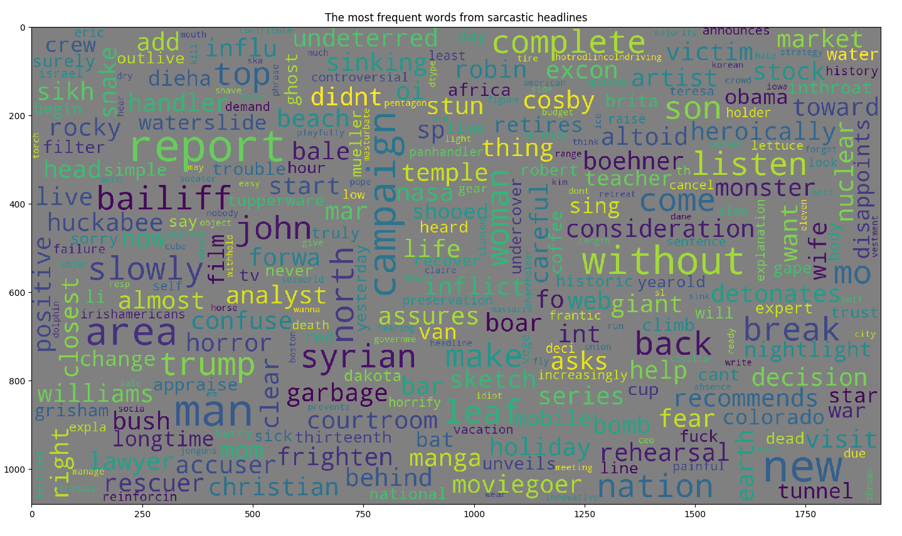
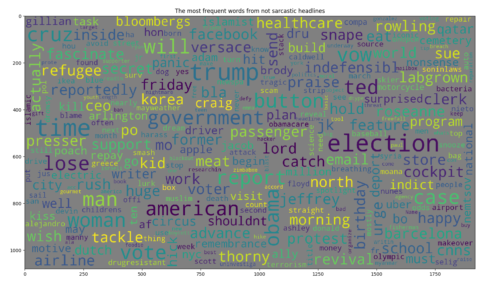
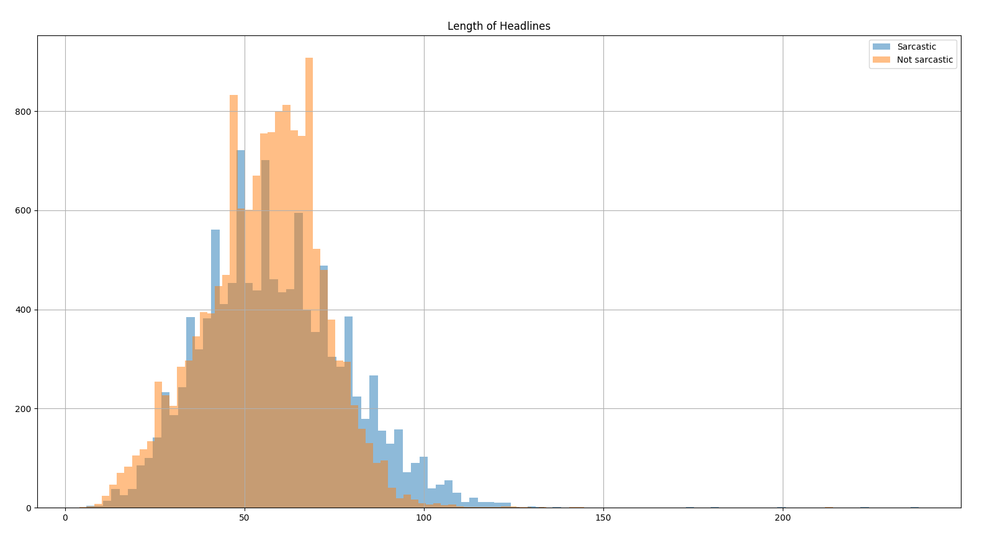
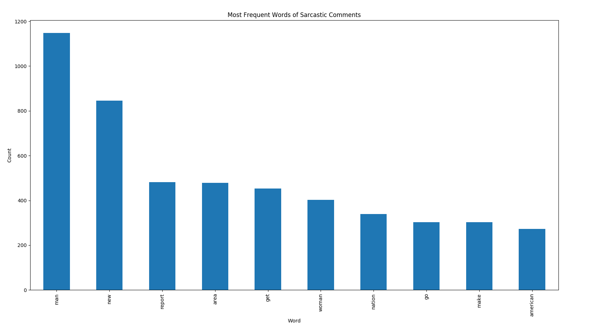
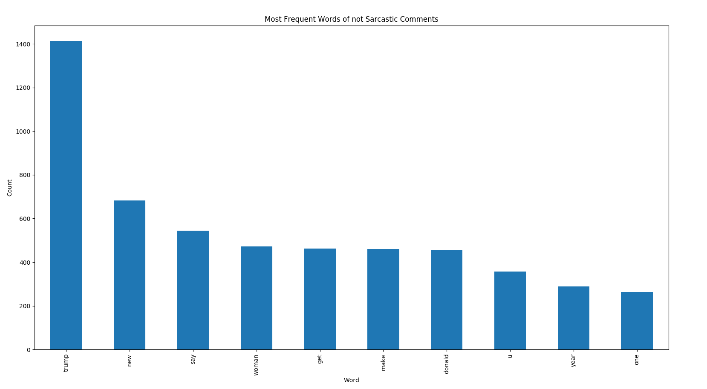
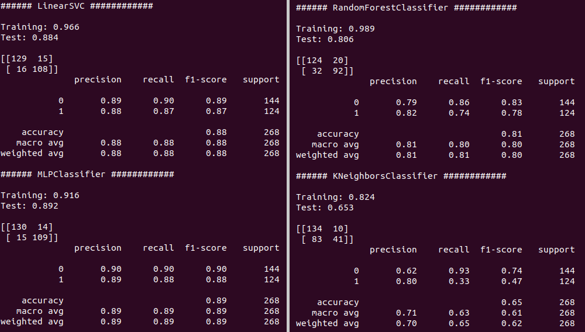

# sarcasmDetection
Detecting sarcastic headlines of Internet articles' and newspapers' headlines 

   
Word map of sarcastic words. 

   
Word map of non-sarcastic words. 

   
Histogram of length of sentences in characters. We can see that sarcastic sentences tend to be longer. 

   
The most frequent sarcastic words after removal of stop words. 

   
The most frequent non-sarcastic words after removal of stop words. 

   
Test of classifiers on a test size of 10% of the dataset without k-fold.  
